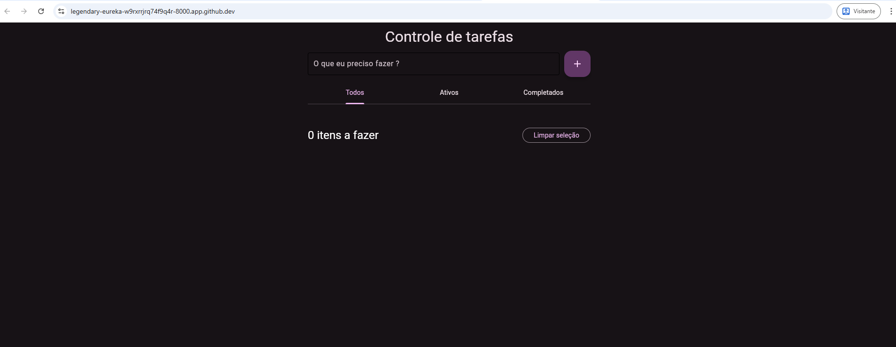

# Controle de Tarefas (To-Do List)

Bem-vindo ao projeto **Controle de Tarefas**! Este é um aplicativo simples e moderno de lista de tarefas desenvolvido em Python utilizando o framework [Flet](https://flet.dev/). O objetivo é proporcionar uma experiência intuitiva para organizar e acompanhar suas atividades diárias.

## ✨ Funcionalidades

- **Adicionar tarefas** rapidamente com um campo de texto e botão de ação.
- **Editar o nome** de uma tarefa já criada.
- **Marcar tarefas como concluídas** com um simples checkbox.
- **Filtrar tarefas** por status: Todos, Ativos e Completados.
- **Excluir tarefas** individualmente.
- **Limpar todas as tarefas concluídas** com um clique.
- **Contador dinâmico** de tarefas restantes, com cores que mudam conforme a quantidade.
- **Interface responsiva e escura**, com fontes personalizadas para uma experiência agradável.

## 🚀 Como executar

1. **Clone o repositório:**
   ```bash
   git clone <url-do-repositorio>
   cd Lista_de_Tarefas
   ```

2. **Instale as dependências:**
   ```bash
   pip install flet
   ```

3. **Execute o aplicativo:**
   ```bash
   python main.py
   ```

4. O app abrirá em uma janela ou navegador. Basta começar a usar!

## 🖋️ Estrutura do Projeto

- `main.py`: Código principal do app, contendo toda a lógica e interface.
- `fonts/`: Pasta com as fontes customizadas utilizadas na interface.

## 🛠️ Tecnologias Utilizadas

- [Python 3.8+](https://www.python.org/)
- [Flet](https://flet.dev/) (UI moderna para Python)

## 💡 Dicas de Uso

- Para adicionar uma tarefa, digite no campo e pressione Enter ou clique no botão de "+".
- Use os ícones de lápis para editar e de lixeira para excluir tarefas.
- O botão "Limpar seleção" remove todas as tarefas já concluídas.
- O contador de tarefas muda de cor conforme a quantidade de pendências.

## 📸 Screenshots


- **Tela Inicial:**
  


## 👨‍💻 Contribuição

Fique à vontade para abrir issues, sugerir melhorias ou enviar pull requests! Este projeto é um ótimo ponto de partida para quem quer aprender Flet ou criar aplicações desktop/web com Python.

---

Feito com 💜 por desenvolvedores Python entusiastas.
